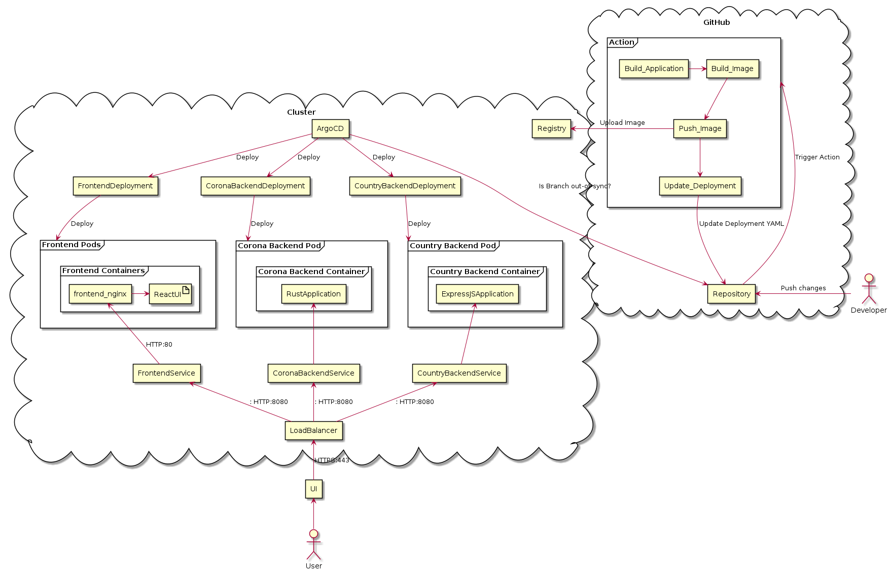
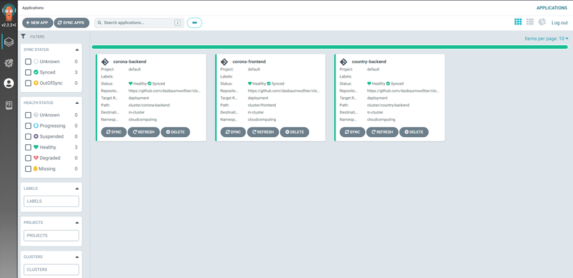
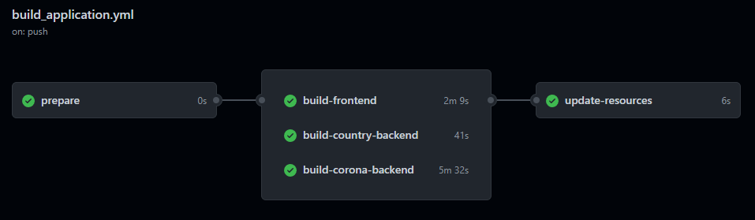

<div id="top"></div>

<div align="center">
  <h3 align="center">Documentation</h3>
</div>

<details>
  <summary>Overview</summary>
  <ol>
    <li><a href="#description">Project description</a></li>
    <li>
      <a href="#services">Services</a>
      <ul>
        <li><a href="#frontend">Frontend</a></li>
        <li><a href="#corona-backend">Corona Backend</a></li>
		    <li><a href="#country-backend">Country Backend</a></li>
      </ul>
    </li>
    <li>
      <a href="#used-technologies">Used Technologies</a>
      <ul>
        <li><a href="#helm-chart">Helm chart</a></li>
        <li><a href="#argocd">ArgoCD</a></li>
		    <li><a href="#github-actions">GitHub Actions</a></li>
      </ul>
    </li>
    <li>
      <a href="#deployment">Deployment</a>
      <ul>
        <li><a href="#todo">TODO</a></li>
      </ul>
    </li>
    <li><a href="#lessons-learned">Lessons Learned</a></li>
  </ol>
</details>


## Project description

The project should show how much effort and development is needed to have a fully automated CI/CD flow using GitHub Actions as a CI for building, (testing), and creating deployment images as well as a tool called ArgoCD as continuous delivery tool.

To better showcase this, we built three different applications namely one frontend and two backends to get a good feeling how fast and easy we can develop and ship a new versions of an entire microservice architecture.

The basic idea behind the application is, to have the frontend request the two backends for different data. In our case, we chose to provide the newest COVID-19 data for each country worldwide. For this, we are using two external APIs which in theory could be replaced with our own data which could be stored in a database also running somewhere in the cluster.

The following illustration should show the whole architecture we are using



<p align="right">(<a href="#top">back to top</a>)</p>

## Services

For this project we developed three different, independent services. Two backend API services which are developed in Rust and TypeScript as well as a frontend which uses those two APIs to illustrate some data.

<p align="right">(<a href="#top">back to top</a>)</p>

### Frontend

The frontend is built using [React.js](https://reactjs.org/) and [Tailwind CSS](https://tailwindcss.com/) as a CSS framework. Its main purpose is, to fetch data from our two backends which includes an API to fetch all countries worldwide including their flag and other additional data. The second API provides the most-recent COVID-19 data for a selected country (provided as parameter).

For building the image, the build process makes use of multi-stage builds which main advantage is to keep the built image size low. For this, the build contains two stages, one where [NodeJS](https://nodejs.org/) is set up, where all packages (node_modules) are installed to build the frontend. The second stage is the "real" image which is pushed to the registry that in our case only copies the built frontend to our defined destination (Nginx default web server folder).

```Dockerfile
FROM node:14-alpine as base

COPY package.json ./
COPY yarn.lock ./

RUN yarn install

...
... # copy some files
...

RUN yarn build # build frontend (saved to /build)

# second stage containing only necessary files & directories
FROM nginx:1.20-alpine

# copy build folder into default web server folder
COPY --from=base /build /usr/share/nginx/html 
```
_[Frontend Dockerfile](frontend/Dockerfile)_


For the resulting image which is pushed to the registry, we chose Nginx's alpine version to keep the size as low as possible for serving the frontend to the public.


<p align="right">(<a href="#top">back to top</a>)</p>

### Corona Backend

The corona backend is built using [Rust](https://www.rust-lang.org/) using [actix](https://actix.rs/) as a web server. It provides an API, allowing the client to fetch corona data based on country with optionally being able to specify the time range of the data.

It gets this data from the API [covid19api](https://api.covid19api.com) using the [reqwest](https://github.com/seanmonstar/reqwest) library to fetch it on demand. It then caches this response using the [cached](https://github.com/jaemk/cached) library, making the following requests to the backend more performant.

The image of the backend is built with multi-stage builds, which allow the developer having a build and a final Dockerfile, allowing the developer to copy files and directories from the build Dockerfile.

In this case, the image `rust-musl-builder` is used, which makes it possible building a statically linked rust executable. This means that all the dependencies including the standard library and others (like openssl) are bundled in one executable. This also means that the release Docker image consists only of an Alpine-Linux image and the executable:

```Dockerfile
FROM alpine:3.15

RUN apk update &&\
    apk upgrade &&\
    apk --no-cache add ca-certificates

COPY --from=build /build/target/x86_64-unknown-linux-musl/release/corona-backend /usr/local/bin/corona-backend
RUN chmod +x /usr/local/bin/corona-backend

ENTRYPOINT /usr/local/bin/corona-backend
```

<p align="right">(<a href="#top">back to top</a>)</p>

### Country Backend
The Country Backend is built as a [Node.js](https://nodejs.org/en/) microservice using the [Express.js](https://expressjs.com/) framework in combination with [Typescript](https://www.typescriptlang.org/). The REST API has a simple interface to fetch country data used for the country selector in the web application. 
Via a `GET` request to the `/api/all` endpoint, a JSON of all countries and their specific data is returned. For the country data, we used the [Rest Countries](https://restcountries.com/) project as a source, which provides all kind of interesting data to each country on the planet. 

There are also start and build scripts and a Dockerfile configuration to create an image of this microservice:

```Dockerfile
FROM node:14-alpine as base

COPY package.json ./
COPY yarn.lock ./

RUN yarn install

COPY src ./src
COPY tsconfig.json ./tsconfig.json

RUN yarn build


# second stage containing only necessary files & directories
FROM node:14-alpine

COPY --from=base ./node_modules ./node_modules
COPY --from=base /dist /dist

EXPOSE 8081
CMD ["dist/index.js"]
```

<p align="right">(<a href="#top">back to top</a>)</p>

## Used Technologies
The following section includes some of the most important technologies we used for this project.

<p align="right">(<a href="#top">back to top</a>)</p>

### Helm chart
Helm chart is a package manager for Kubernetes which helps you to manage very complex Kubernetes applications. With the help of Helm, it is easier to update, share and potentially rollback complex applications which have a lot of different dependencies. In our case, we used the "Bitnami" version of ArgoCD to deploy it as well as to configure it to our needs. For example, we decided to re-use an existing Redis database which was already running on the cluster instead of having it deployed via the default ArgoCD install.

<p align="right">(<a href="#top">back to top</a>)</p>

### ArgoCD
ArgoCD is a declarative, GitOps continuous delivery tool for Kubernetes which helps us to automate, audit, and easy understand our application definitions, configurations and environments. It also is versioned controlled which means that we can always recover and rollback fairly easy and fast.

It consists  of three main components:
1. API Server: API which exposes the API consumed by the Web UI, CLI and CI/CD systems. For example, it is the listener/forwarder for Git webhook events or responsible for invoking of application operations (e.g. sync, rollback, user-defined actions)
2. Repository Server: an internal service which maintains a local cache of the Git repository holding the application manifests. It is responsible for generating and returning the Kubernetes manifests when provided with inputs such as the repository url, revision, template specific settings, etc.
3. Application Controller: a service which continuously monitors running applications and compares the current, live state against the desired target state. Its main responsibility is to detect OutOfSync applications states and optionally take corrective action

Adding applications to ArgoCD is fairly simple and convenient. 
1. You provide a name, choose the project you want to add it to
2. Set the sync policy (+ optional sync options)
3. Set your "Source", in our case the GitHub repository + a branch
4. Set your "Destination" in the cluster (cluster URL + namespace)

... everything else is automatically done by ArgoCD in the background



Once all applications have been added, the dashboard shows all of them with their current status. It also provides more details when clicking on the application itself.

[Link to ArgoCD docs](https://argo-cd.readthedocs.io/)

<p align="right">(<a href="#top">back to top</a>)</p>

### GitHub Actions

[GitHub Actions](https://github.com/features/actions) is a continuous integration and continuous delivery (CI/CD) tool that helps automating builds, tests, deployments, etc. Workflows can be created easily directly in the projects GitHub repository which can then handle different events (e.g opened pull requests, commits to a specific branch, opened issues, etc.). These events then trigger Jobs that execute specific tasks.

<p align="right">(<a href="#top">back to top</a>)</p>

## Deployment
The project was deployed on a personal Kubernetes cluster. 

### Build Process
As mentioned in the Technology section, we use GitHub Actions to build the services. This happens in several steps:

- Prepare
  - sets release date
- build-frontend, build-country-backend, build-corona-backend
  - builds application based on dockerfile
  - pushes image to registry
  - updates deployment yaml
- update-resources
  - pushes changes to `deployment` branch
 



### Prerequisites
This cluster was already set-up with various basics, assumed to be prerequisites for this repository:
* Kubernetes cluster with working pod-to-pod communication (Using, for example, [Flannel](https://github.com/flannel-io/flannel))
* [Traefik](https://traefik.io/)  
This is a reverse proxy and service load balancer, accepting requests from outside and routing them to the appropriate service, based on `IngressRoutes`
* [cert-manager](https://cert-manager.io/docs/)  
This allows for automatically requesting a TLS certificate from [Let's Encrypt](https://letsencrypt.org/).

### Repository structure
To keep the repository structured and the Kubernetes YAML configs readable, we used Kustomize. This program builds a ready-to-apply YAML out of multiple imported YAMLs, making the maintenance of the repository easier. It furthermore is able to use [Helm Charts](https://helm.sh) as a basis with the ability to patch those with handwritten config.

Although Kustomize is normally used for large clusters with multiple environments, where there exists one base config and patches are applied on top of them, it also shines in splitting various configs up.

### Deployment structure
All the custom deployments that we wrote, are built similarly. They contain four important files:
* `kustomization.yaml`  
This is the base file for Kustomize, letting it know which configs to include when building the final config.
```yaml
apiVersion: kustomize.config.k8s.io/v1beta1
kind: Kustomization

resources:
  - resources/deployment.yaml
  - resources/ingress.yaml
  - resources/service.yaml
```

* `deployment.yaml`  
The deployment controls how many pods run where and what "templates" those pods have. This config, for example, tells Kubernetes to create one replica of a pod with the image `registry.guldner.eu/cloudcomp-corona-backend:20211219-1852`, while exposing the port `8080`. One more important thing is the `label`, which will be needed for the service.

```yaml
apiVersion: apps/v1
kind: Deployment
metadata:
  name: corona-backend
  namespace: cloudcomputing
spec:
  replicas: 1
  selector:
    matchLabels:
      app: cloudcomp-corona-backend
  template:
    metadata:
      labels:
        app: cloudcomp-corona-backend
    spec:
      containers:
      - name: cloudcomp-corona-backend
        image: registry.guldner.eu/cloudcomp-corona-backend:20211219-1852
        ports:
        - containerPort: 8080
      imagePullSecrets:
      - name: pull-secret
```
* `service.yaml`  
This is the connector between the deployment and the ingress. It specifies basically a service, which is an abstraction layer, making it available to everyone in the cluster. This config specifies that the service accepts packets at port `8080`, which are then forwarded to any pod matching the `label` on the port `8080`.
```yaml
apiVersion: v1
kind: Service
metadata:
  name: cloudcomp-corona-backend
  namespace: cloudcomputing
  labels:
    app: cloudcomp-corona-backend
spec:
  selector:
    app: cloudcomp-corona-backend
  ports:
  - port: 8080
    protocol: TCP
    targetPort: 8080
```

* `ingress.yaml`  
The last config needed is the `IngressRoute`. This tells Traefik how and what HTTP requests to route to the service created previously. In this case it also defines a middleware, that strips the prefix of the path (`/corona`).
```yaml
apiVersion: traefik.containo.us/v1alpha1
kind: IngressRoute
metadata:
  name: corona-backend
  namespace: cloudcomputing
spec:
  entryPoints:
  - websecure
  routes:
  - kind: Rule
    match: Host(`schwap.kainzinger.guldner.eu`) && PathPrefix(`/corona`)
    services:
    - name: cloudcomp-corona-backend
      scheme: http
      port: 8080
    middlewares:
    - name: stripprefix
  tls:
    secretName: schwap.kainzinger.guldner.eu
```

<p align="right">(<a href="#top">back to top</a>)</p>

## Installation
### Installation Prerequisites

* [See Kubernetes Prerequisites](#prerequisites)
* Helm3
* Docker

### Installation Steps
1. Deploy ArgoCD
`cd cluster && kustomization build --enable-helm argo > out.yaml && kubectl apply -f out.yaml`
1. Deploy registry  
`cd cluster && kustomization build --enable-helm registry > out.yaml && kubectl apply -f out.yaml`
1. Build images and push to registry (if not done by GitHub Action)
1. Update all deployment.yaml (if not done by GitHub Action)
1. Deploy rest
`cd cluster && kustomization build --enable-helm all > out.yaml && kubectl apply -f out.yaml`

<p align="right">(<a href="#top">back to top</a>)</p>

## Lessons Learned

In general we are amazed how relatively easy and fast you can build and ship an entire application which is split up into multiple independent microservices.

Starting off, microservices are just amazing! It allows teams of individual sizes to build independent services in their own preferred programming language and framework.
Also, they can be scaled much easier than huge monolithic applications while maintaining good performance by intelligently splitting up load across all replicas.

When combining microservices and intelligent continuous delivery tools like ArgoCD for Kubernetes, the only time you should experience downtime is when your whole cluster fails (which is highly unlikely for huge cloud providers such as AWS, Google Cloud or Azure). ArgoCD not only syncs your configs inside your cluster, it also provides a great overview how your pods/services/etc. are doing and what configurations changed in a newer version in a config file. It is also astonishing, that ArgoCD is basically a "set and forget" deployment with an intuitive UI to add and manage your applications that just works.

GitHub Actions are also great to use due to their community-powered workflows which provide a simple way to make use of more advanced workflows that otherwise would require more configuration/installation inside an CI job. For example, instead of installing, setting up, logging into Docker for each individual job, we just used a workflow ``docker/login-action@v1``, entered the our custom registry url + login credentials and where ready to build and push Docker images to the registry.

```yaml
...
  - name: Login
    uses: docker/login-action@v1
    with:
      registry: registry.guldner.eu
      username: ${{ secrets.REGISTRY_USERNAME }}
      password: ${{ secrets.REGISTRY_PASSWORD }}
...
```
GitHub Actions might also run different kinds of test (e2e test, unit test, etc.) before building the application to make sure everything is still working as intended. With good test coverage it would also be more safe to enable auto-sync in ArgoCD to instantly deploy new versions without manual syncing. 

For us, it was clear to have a monorepo in the beginning that holds the code of each backend and the frontend as well as all all the Kubernetes configs and resources. The main advantage of this is the better overview of the whole project  when building and setting everything up for the first time. In the long run or if more team work on the same application, it would be better to split the applications and the Kubernetes resources into at least two repositories (code + infrastructure) to be better manageable.

<p align="right">(<a href="#top">back to top</a>)</p>
