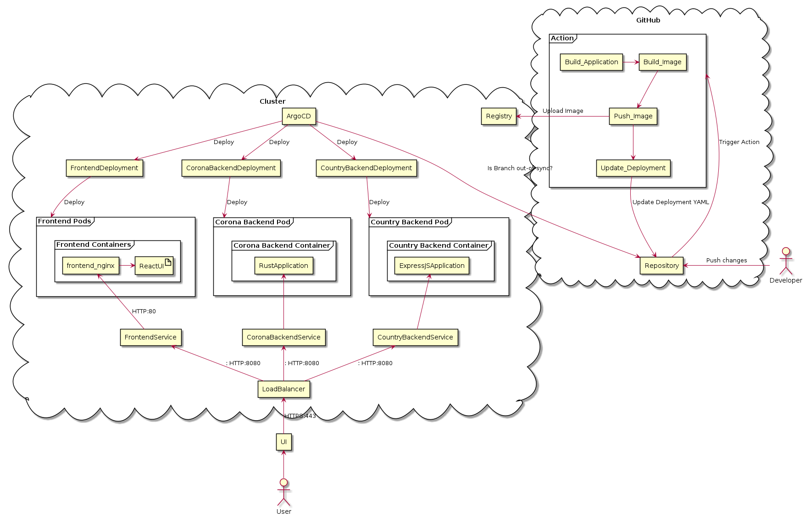

# Definition of Scope and Project
* Stateless Microservice
  * Corona Backend in Rust
    * Fetches Corona APIs for selected countries
    * Caches the result 
    * Returns the data
  * Country Backend in Express.JS
    * Fetches countries from API
    * Caches the result
    * Returns the data
  * Frontend in React
    * Fetches countries from express.js backend
    * Shows dropdown to select countries
    * Fetches corona data from rust backend
    * Displays the result and if it was cached
* CI/CD Github actions
  * Build apps
  * Build Docker images
  * Push image
  * Deploy (or ArgoCD)
* Kubernetes
  * Kustomize
  * Deploy cluster (LoadBalancer)
  * Deploy ArgoCD (or Github action deploy)
  * Deploy applications (Deployment, Service, Ingress, Certificate)

The following image describes the architecture:

# Definition of Milestones
* Start project
* Microservices are running locally
* Dockerfiles work + Github actions builds automatically on push to master
* Kubernetes Cluster is running
* Kubernetes Cluster + Microservices are running

# Assignments of Responsibilities
* Alexander Kainzinger: 
  * Frontend (+ Dockerfile)
  * ArgoCD
    * Installation and basic configuration
    * Enable and Configure Auto-Sync
    * Set up deployments of apps
* Gabriel Guldner: 
  * Corona Backend (+ Dockerfile)
  * Kubernetes cluster
    * Set up https and certificate for domain
    * Set up ingress
    * Set up Docker registry
    * Set up service
* Tobias Schwap:
  * Country Backend (+ Dockerfile)
  * GitHub Actions
    * Set up automatic triggering of actions
    * Set up build jobs
    * Set up release job (update deployment YAML)
